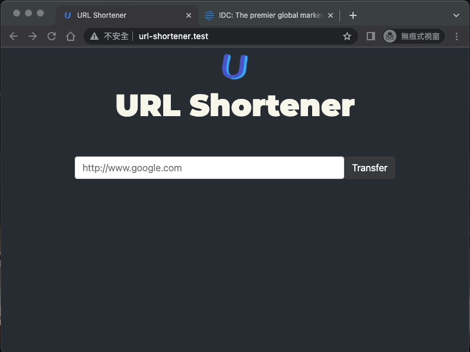

# URL Shortener
`#Docker` `#Kubernetes` `#Flask` `#PostgreSQL`
A lightweight url shortener which can run with native docker & kubernetes. 




Our project has developed with those awesome packages, and please kindly refer to our project structure as below
- [x] Flask
- [x] Redis
- [x] PostgreSQL
- [x] Celery
- [x] Nginx

``` lua
    ├── apps/   -- kind of services' config and source code 
        ├── frontend/
        ├── nginx/
        ├── p3x/
        ├── redis/
        └── transferservice/
    ├── data/   -- store apps database
        ├── pgadmin/
        ├── redis/
        └── transferdb/
    ├── dockeryml/  --  define services in native docker
    ├── kubeyml/  --  define services in k8s
    ├── logs/
    └── deployer.sh
```
___
## Steps
## Run with native docker

```sh
# 1. Build images
bash deployer.sh build

# 2. Init database
bash deployer.sh init

# 3. Start services
bash deployer.sh up

# 4. Stop services
bash deployer.sh down
```
___
## Run with k8s
1. Setup with YAML files in `kubeyml/`
    ```sh
    # 1. Build Images (frontend, transferapp)
    docker build -t micro/frontend --build-arg APP_NAME=FlaskApp --build-arg FLASK_APP=main.py ./apps/frontend
    docker build -t micro/transferservice --build-arg APP_NAME=FlaskApp --build-arg FLASK_APP=main.py ./apps/transferservice

    # 2. Applye ConfigMap & Secret (one-time data)
    kubectl apply -f ./kubeyml/cm_develop.yml
    kubectl apply -f ./kubeyml/secret_develop.yml

    ### check ##########################
    kubectl describe secret
    kubectl get secret micro-develop-credentials -o jsonpath='{.data}'

    # 3. Create PV & PVC (frontend, trasferdb)
    kubectl create -f ./kubeyml/micro_frontend_pv.yml
    kubectl create -f ./kubeyml/micro_frontend_pvc.yml
    kubectl create -f ./kubeyml/micro_transferdb_pv.yml
    kubectl create -f ./kubeyml/micro_transferdb_pvc.yml

    ### check ##########################
    kubectl get pv micro-frontend-pv
    kubectl get pv micro-frontend-pvc
    kubectl get pv micro-transferdb-pv
    kubectl get pv micro-transferdb-pvc


    # 4. Apply deployment (frontend, transferdb, transferapp)
    kubectl apply -f ./kubeyml/micro_frontend_deploy.yml
    kubectl apply -f ./kubeyml/micro_transferdb_deploy.yml
    kubectl apply -f ./kubeyml/micro_transferapp_deploy.yml

    # 5. Apply service (frontend, transferdb, transferapp)
    kubectl apply -f ./kubeyml/micro_frontend_svc.yml
    kubectl apply -f ./kubeyml/micro_transferdb_svc.yml
    kubectl apply -f ./kubeyml/micro_transferapp_svc.yml

    # 6. Execute migration job
    kubectl apply -f ./kubeyml/micro_transferapp_job.yml
    kubectl logs job/transferapp-migration
    kubectl delete job transferapp-migration

    # 7. Enable ingress
    kubectl apply -f https://raw.githubusercontent.com/kubernetes/ingress-nginx/controller-v0.34.1/deploy/static/provider/do/deploy.yaml

    kubectl get pods -n ingress-nginx -l app.kubernetes.io/name=ingress-nginx --watch
    kubectl get svc -n ingress-nginx
    kubectl apply -f ./kubeyml/micro_ingress.yml

    ```
2. Edit `/etc/hosts`
    ```
    127.0.0.0.1 url-shortener.test
    ```

3. Try it out:

    ```sh
    curl http://http://url-shortener.test/
    curl http://http://url-shortener.test/healthz/liveness
    curl http://http://url-shortener.test/healthz/readiness
    ```
